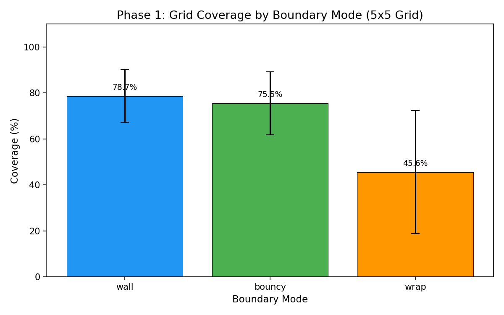
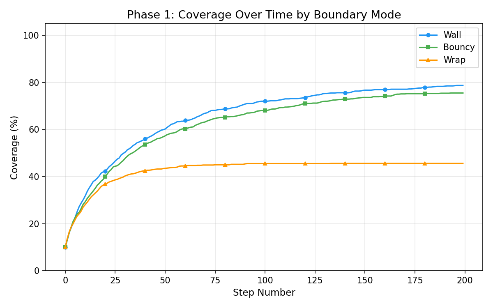
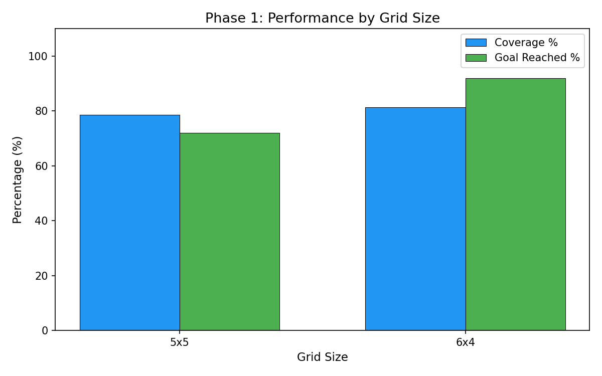
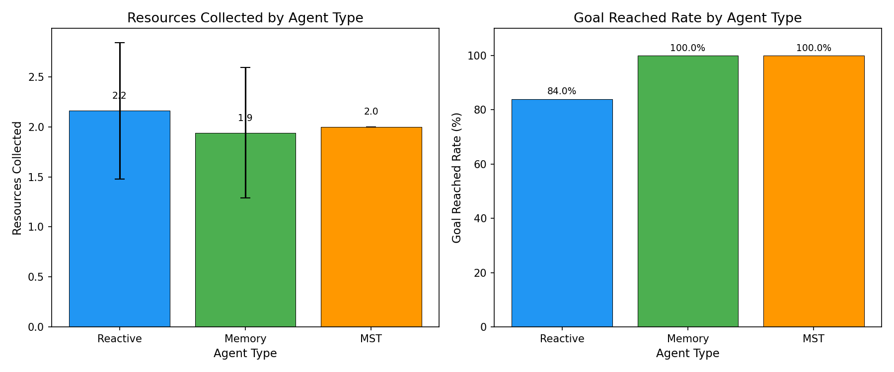
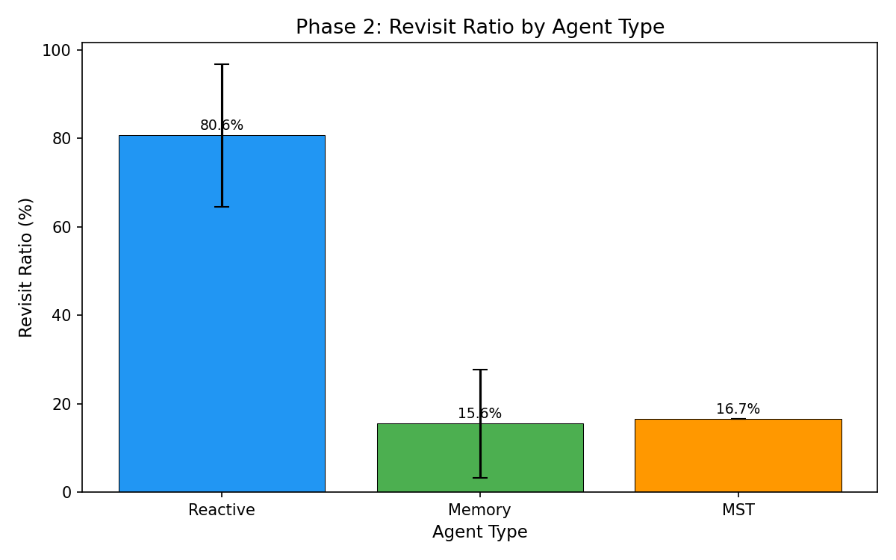
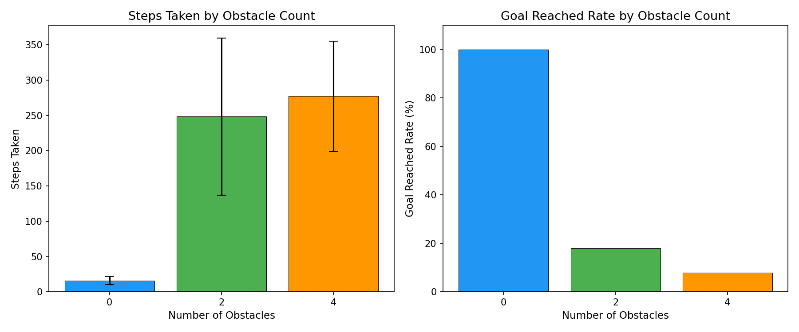
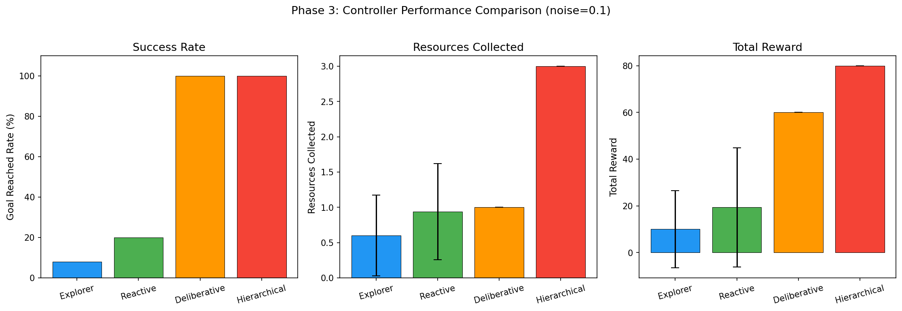
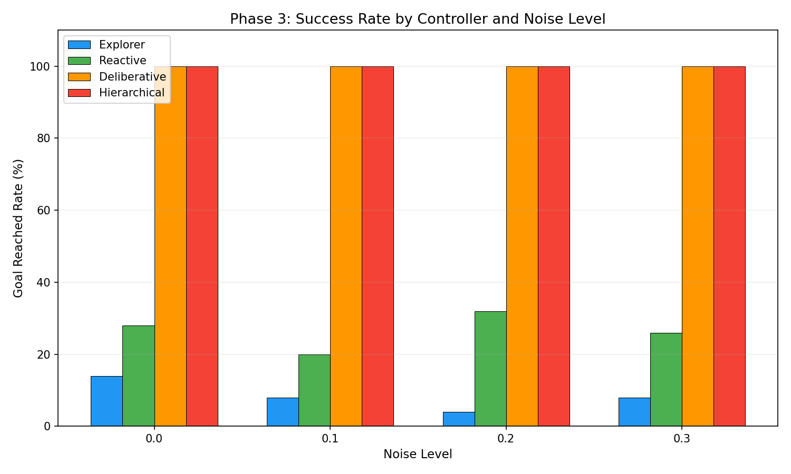
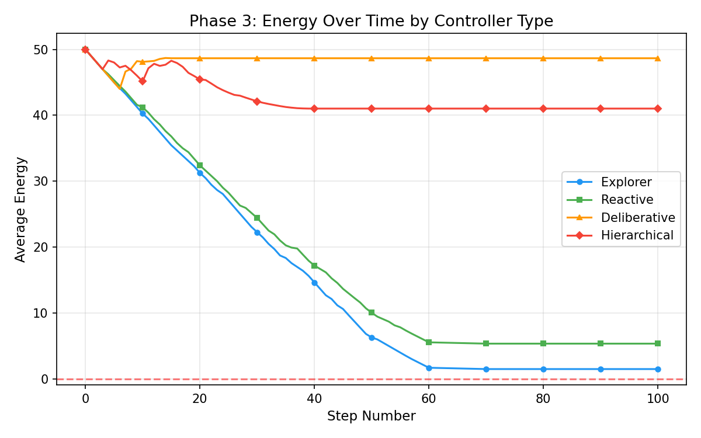
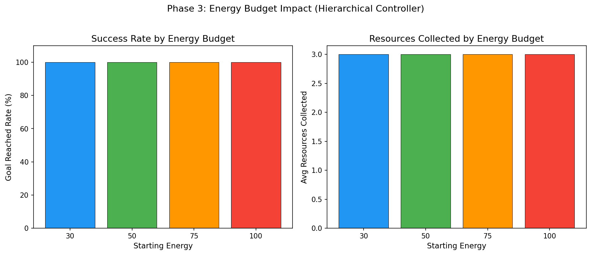

Intelligent Agent Navigation and Decision Making in Discrete Environments

1. Introduction

Autonomous systems that operate in structured, constrained spaces are among the most active areas of applied artificial intelligence today. From warehouse logistics robots sorting thousands of parcels each hour to search-and-rescue drones mapping collapsed buildings after natural disasters, the ability of a software agent to perceive its surroundings, take informed decisions, and act in the face of uncertainty is no longer a theoretical exercise but a pressing engineering challenge. This project takes those real-world demands and distills them into a controlled laboratory setting: a grid-based indoor environment where a simulated service robot has to navigate corridors, collect scattered resources such as food packages or data points, avoid both fixed walls and movable obstacles, reach a designated goal location, and do all of this while managing a finite energy budget.

The investigation is organized around three progressively harder phases. Phase 1 establishes a reactive baseline, asking how different boundary conditions, namely rigid walls, bouncy reflections, and toroidal wrap-around, shape the agent's ability to explore the map. Phase 2 introduces object-oriented memory structures and graph-oriented planning through a Minimum Spanning Tree traversal, asking whether remembering where the agent has already been can meaningfully reduce wasted effort. Phase 3 layers on a hierarchical two-level controller, stochastic action noise, and a depleting energy reserve, asking whether structured decision-making outperforms simpler strategies when the world becomes unpredictable. Together, the three phases trace a path from pure reflex to deliberate reasoning, emulating the evolution seen in real robotic architectures.

2. Methodology

2.1 Environment Design

The environment is modeled as a discrete two-dimensional grid available in two sizes, five-by-five and six-by-four, each containing a mixture of empty floor cells, impassable wall cells, collectible resource cells, a single goal cell, and, in later phases, movable obstacle cells. Three boundary modes govern what happens when the agent attempts to step off the edge of the map. In wall mode, the move is simply rejected, and the agent stays put. In bouncy mode, the agent's direction reverses upon hitting the boundary, pushing it one cell in the opposite direction. In wrap-around mode, the grid is treated as a torus so that walking off the right edge places the agent on the left edge of the same row. These modes were chosen because they correspond to common assumptions in robotics: hard physical walls, elastic bumpers, and cyclic conveyor layouts, respectively.

2.2 Agent Architecture

All agents inherit from a common reactive base class that senses adjacent cells, picks a random valid direction, executes the move, and records statistics such as steps taken, cells visited, and resources collected. The memory agent extends this base by maintaining a set of visited positions and a frontier of candidate edges, which are unvisited cells adjacent to already-visited ones. At each step, the memory agent prefers to move into an unvisited neighbor; when none is available, it uses breadth-first search to find the shortest path back to the nearest frontier cell, thereby systematically covering the grid without the aimless wandering of a purely random walker. The MST agent goes further: before moving, it computes a Minimum Spanning Tree over all resource positions and the goal using Prim's algorithm with Manhattan-distance weights, then performs a depth-first traversal of the tree to determine an efficient visitation order, navigating between tree nodes via grid-level BFS pathfinding.

For Phase 3, the hierarchical agent adds an energy attribute that decreases by 1 per step and is partially restored whenever a resource is collected. A noise parameter introduces stochastic deviation: with a configurable probability, the agent executes a random perpendicular action instead of the intended one, emulating real-world actuator imprecision. Decision-making is delegated to a pluggable controller object. Four controllers were implemented and compared. The explorer controller picks a direction uniformly at random from all four compass points, including invalid ones, so it frequently wastes moves bumping into walls. The reactive controller first filters out walls, then randomly selects a valid option. The deliberative controller uses BFS to find the shortest path to the goal and follows it, with a cycle-detection mechanism that injects a random move when the agent oscillates between two positions. The hierarchical controller operates at two levels: a high-level strategy selector chooses between survival mode (when energy is low), directing the agent straight to the goal; gathering mode (when resources are nearby); and exploration mode (otherwise), while a low-level navigator uses BFS and greedy direction selection to move toward the chosen sub-goal.

2.3 Experimental Setup

Each experimental condition was repeated 50 times with deterministic seeding to ensure reproducibility. A base random seed of forty-two was offset by the episode number so that every agent type faced the same sequence of random settings within a given experiment. Phase 1 episodes ran for up to 200 steps, Phase 2 for 300, and Phase 3 for 500. The metrics recorded per episode included the number of steps taken, whether the goal was reached, the count of resources collected, the fraction of non-wall cells visited, which is referred to as coverage, the revisit ratio defined as the number of steps landing on an already-visited cell divided by total steps, and, for Phase 3, the remaining energy and cumulative reward. Summary statistics report the arithmetic mean and sample standard deviation across episodes.

3. Results

3.1 Phase 1: Boundary Mode Effects

On the five-by-five grid, the wall-bounded agent obtained a mean coverage of 78.7 percent with a goal-reached rate of 72 percent. Bouncy boundaries produced slightly lower coverage at 75.5 percent and a 62 percent goal rate because the reflection sometimes pushed the agent away from productive directions. Wrap-around yielded only 45.6 percent coverage but, counterintuitively, a 100 percent goal-reached rate: the toroidal topology created shortcuts that let the random walker stumble onto the goal quickly, even though it explored fewer unique cells.

*Figure 1: Mean grid coverage across 50 episodes for each boundary mode on the 5x5 grid. Wall mode keeps the agent confined, leading to the highest local coverage (78.7%). Wrap-around mode allows the agent to teleport across edges, which reduces coverage to 45.6% because the agent scatters across the grid rather than exploring contiguously. Error bars show standard deviation.*

*Figure 2: Average coverage percentage plotted against step number for each boundary mode. Wall and bouncy modes show a steady upward curve that begins to plateau around step 100, indicating diminishing returns as fewer unvisited cells remain. Wrap-around coverage plateaus much earlier at roughly 45%, confirming that the toroidal topology causes the agent to revisit distant regions rather than filling in nearby gaps.*

Comparing grid sizes, the six-by-four layout produced a higher goal rate of 92 percent versus 72 percent for five-by-five, likely because the rectangular shape offers fewer dead-end corridors.

*Figure 3: Coverage and goal-reached rate compared across the two grid sizes. The 6x4 grid's narrower corridors funnel the random agent toward the goal more reliably (92% vs 72%), while coverage is comparable between both layouts (~79-81%).*

3.2 Phase 2: Memory and Planning

The reactive agent revisited cells on 80.6 percent of its steps, confirming that random movement is overwhelmingly redundant. The memory agent cut that figure to 15.6 percent by actively steering toward unvisited frontier cells. The MST agent was similarly efficient at 16.7 percent revisits but reached the goal in every single episode, compared to the reactive agent's 84 percent, and collected a consistent 2 out of 3 resources on its planned route.

*Figure 4: Resources collected and goal-reached rate by agent type. Both Memory and MST agents reach the goal 100% of the time compared to 84% for the Reactive agent. The Reactive agent collects slightly more resources on average (2.2) because it wanders longer and stumbles onto them, but this comes at the cost of far more steps and lower reliability.*

*Figure 5: Revisit ratio (percentage of steps landing on an already-visited cell) by agent type. The Reactive agent wastes 80.6% of its moves revisiting cells it has already seen. Memory-based agents reduce this to under 17%, a five-fold improvement in navigation efficiency that demonstrates the value of maintaining a visited-cell frontier.*

When movable obstacles were introduced, performance dropped sharply: with two obstacles, the memory agent's goal rate fell to 18 percent, and with four obstacles to just 8 percent, indicating that obstacle pushing, while functional, often blocks critical corridors.

*Figure 6: Effect of movable obstacles on the Memory agent. With zero obstacles the agent reaches the goal in 100% of episodes using only ~15 steps. Adding 2 obstacles causes steps to spike to ~248 and goal rate to plummet to 18%. With 4 obstacles the situation worsens further (8% goal rate), as pushed obstacles frequently block the only available paths through the grid.*

3.3 Phase 3: Hierarchical Decision-Making

The controller comparison at 10 percent action noise revealed a sharp hierarchy. The explorer controller reached the goal in only 8 percent of episodes and accumulated a mean reward of 10. The reactive controller improved to 20 percent and 19.4 reward. The deliberative controller, with BFS pathfinding, achieved a perfect 100 percent goal rate and 60 reward, but collected only one resource on average because it headed straight for the goal without detours. The hierarchical controller matched the 100 percent goal rate while also collecting all three resources for a mean reward of 80, demonstrating that the two-level strategy of gathering resources before heading to the goal pays off.

*Figure 7: Side-by-side comparison of the four controllers at 10% noise. The Hierarchical controller dominates all three metrics: 100% goal rate, 3.0 resources collected, and 80 total reward. The Deliberative controller reaches the goal reliably but only collects 1 resource (60 reward) because it ignores resource gathering. Explorer and Reactive controllers fail most episodes due to energy depletion before reaching the goal.*

Noise sensitivity analysis showed that explorer and reactive controllers degraded as noise increased, while deliberative and hierarchical controllers remained at 100 percent across all tested noise levels from 0 to 30%.

*Figure 8: Goal-reached rate for each controller across four noise levels (0%, 10%, 20%, 30%). The Explorer and Reactive controllers hover between 4-32% regardless of noise, since their random strategies are inherently unreliable. Deliberative and Hierarchical controllers maintain a perfect 100% at every noise level, demonstrating that BFS-based pathfinding is robust against stochastic action deviation on this grid.*

The energy-over-time plot provided further insight: explorer and reactive agents' energy curves plunged toward zero within fifty steps, whereas the hierarchical agent's energy dipped briefly during resource gathering then stabilized around forty-one thanks to the energy restored by collecting resources.

*Figure 9: Average energy level plotted over the first 100 steps for each controller type. Explorer energy drops fastest, reaching near-zero by step 60. Reactive follows a similar but slightly slower decline. Deliberative energy stabilises at ~49 because the agent reaches the goal within a few steps and stops consuming energy. Hierarchical energy dips during the initial resource-gathering phase then levels off at ~41, reflecting the energy restored by collecting all three resources before heading to the goal.*

*Figure 10: Impact of starting energy budget on the Hierarchical controller's performance. The controller achieves 100% goal rate and collects all 3 resources regardless of whether it starts with 30, 50, 75, or 100 energy units. This confirms that the hierarchical strategy's energy management is efficient enough to operate even under tight energy constraints, thanks to its ability to restore energy through resource collection and switch to survival mode when reserves run low.*

4. Discussion

The three research questions posed at the outset can now be answered concretely. Boundary conditions meaningfully alter navigation dynamics. Wall mode is the most predictable and yields the highest coverage for a random agent because reflections and wraps introduce movement patterns that may bypass useful areas of the grid. Wrap-around creates topological short-cuts that boost goal attainment at the cost of careful exploration, a trade-off that a real system designer would need to weigh against mission requirements.

Agent memory dramatically improves efficiency. Reducing the revisit ratio from over 80 percent to under 17 percent means the memory agent spends five times fewer steps retracing its own path. The MST agent includes a global planning layer that guarantees an efficient visitation order, but its advantage over the simpler memory agent is modest on small grids; the benefit would likely grow on larger maps with more resources.

Hierarchical decision-making is the single largest contributor to effective performance in uncertain conditions. The deliberative controller proves that knowing the shortest path is valuable, but without resource awareness, it leaves reward on the table. The hierarchical controller's ability to switch strategies based on its internal state, prioritizing survival when energy is low and gathering when resources are nearby, resembles the subsumption architecture proposed by Brooks and remains effective even when 30 percent of its actions deviate randomly.

A main limitation of this study is the grid size. The five-by-five and six-by-four grids are small enough that even a random agent will eventually stumble onto the goal. Scaling to larger environments would likely amplify the performance gaps observed here and might expose weaknesses in the BFS pathfinding, which is efficient on tiny grids but would need heuristic acceleration such as A-star on maps with hundreds of cells.

5. Conclusion

This project implemented and evaluated a progression of self-governing agent strategies, from blind reactive movement to memory-guided exploration and MST-based planning, culminating in hierarchical energy-aware decision-making, all operating within discrete grid worlds that abstract the challenges faced by real indoor service robots. The experimental results confirm that each added layer of advancement delivers measurable gains: memory cuts wasted movement by a factor of five, planning guarantees goal attainment, and layered control maximizes total reward whilst preserving tolerance to action noise. Further research might extend the framework with reinforcement learning to let the agent automatically adapt its strategy thresholds, multi-agent coordination for collaborative resource gathering, and larger, procedurally generated maps to stress-test scalability.
